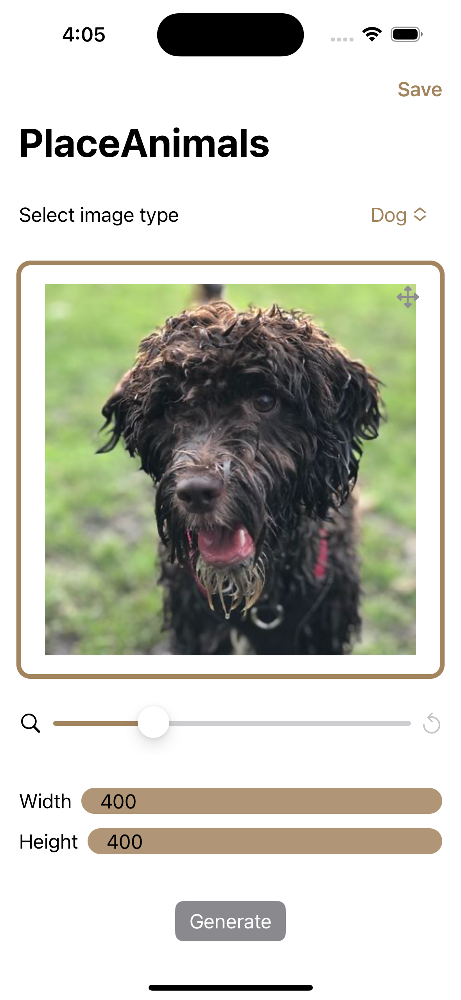

# BearGenerator

## About
BearGenerator or PlaceAnimals* is an iOS app that can generate placeholder images of different resolutions of the following animals: bear, dog, and cat.

## Usage Description

- Users can select an animal type and generate a random placholder image of that animal by pressing the *Generate* button on the app. Users can select the *width* and the *height* of the image.

  

- The app allows users to save the images to their *Photos Library*.

  

- Users can also drag and zoom the image.

  

- The app is available on light mode as well.

  

## API

The app is built with the help of the following api(s) - 

1. [PlaceBear](https://placebear.com)
2. [PlaceDog](https://place.dog)
2. [PlaceKitten](https://placekitten.com)

## LICENSE

[MIT](LICENSE)

